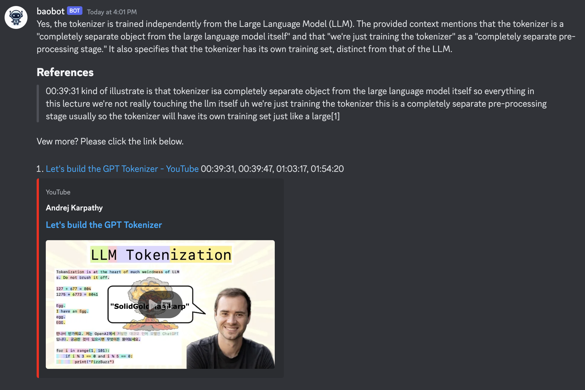
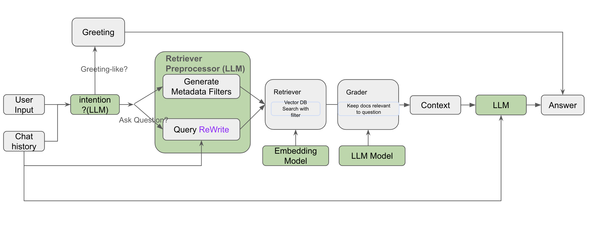

# BaoGPT

BaoGPT is an AI project that allows you to ask questions about youtube videos.

* Web UI (based on Gradio)

* Discrod


> In the case, the target youtube video is [Let's build the GPT Tokenizer](https://www.youtube.com/watch?v=zduSFxRajkE) from Andrej Karpathy.

# How it works

1. In the pipeline, a input question will be routed to the proper branch, greeting-like or query & answer(QA). 
2. When comes to QA, the LLM will do query analysis: extracted attributes as filters and the question will be optimised and rewriten for better vector retrieving in the vector DB. 
3. The filter conditions and optimised question will be passed to the retriever chain and get some top-k candidates for grading.
4. The grader chain will take the question and documents as the grader input and output the final relative documents
5. The LLM will do the summarisation based on the reraking output and provide the answer and attach the sources to the user.
# Install & Run
Before running below cmd, make sure you have figured out the settings in settings.yaml based on your real scenarios.

## Install dependencies
```
# validated on python 3.11.4
# create vitual env 
python3 -m venv .venv
source venv/bin/activate
pip install -Urq requirements.txt
```

## step 1: crawl subtitle from youtube

```
# Note that below steps take Youtube: https://www.youtube.com/watch?v=zduSFxRajkE as example.

python -m bao.components.crawler.youtube_transcript.crawl -v "https://www.youtube.com/watch?v=zduSFxRajkE"
```
## step 2: data ingest:

```
python -m bao.components.injest.injest --injest
```

## step 3: launch the serving for both Discord and Web UI

```
python -m bao
```
